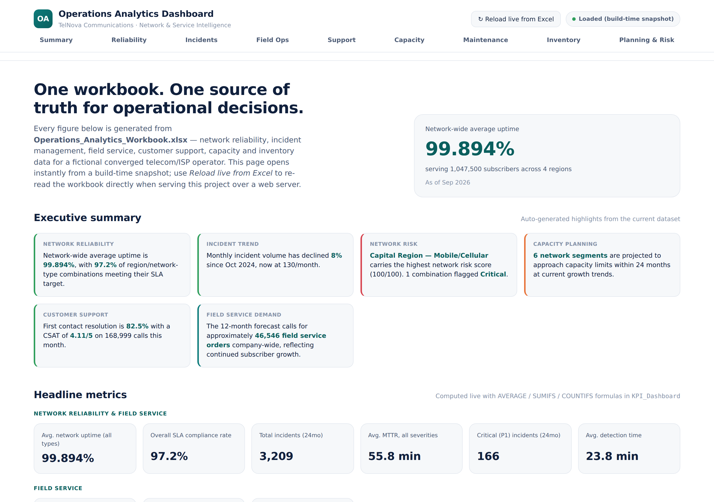
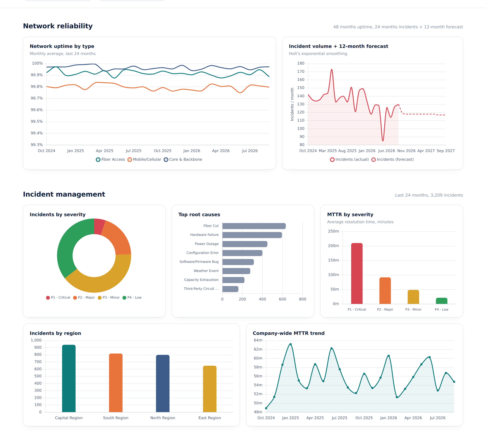
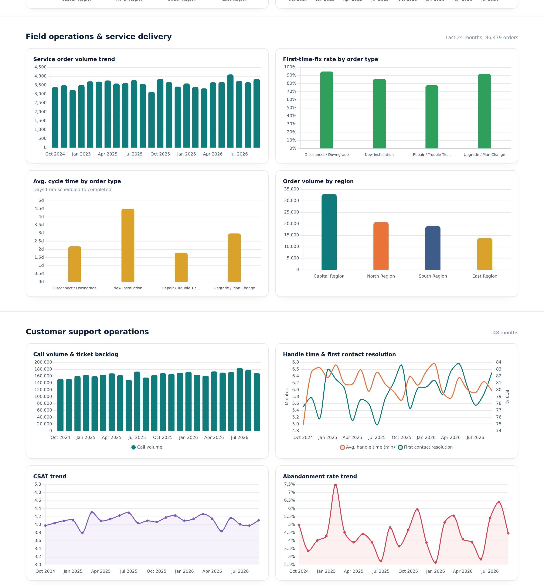
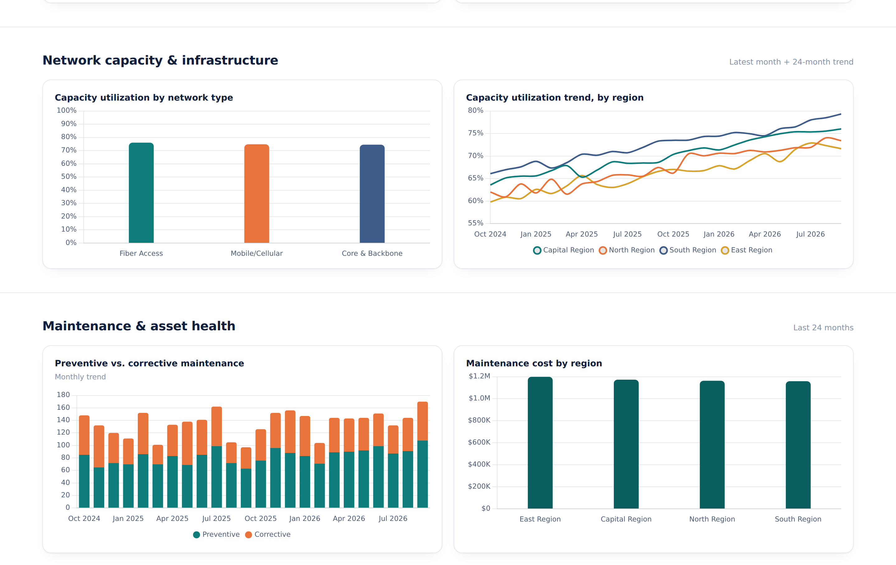
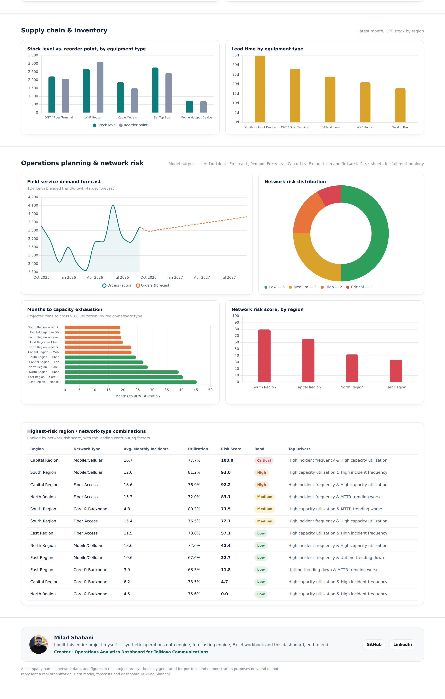

# Operations Analytics Dashboard

**A full-stack Network / Service Operations portfolio project** built around the same fictional telecom & ISP operator as the companion [HR Analytics Dashboard](https://github.com/Milad-Shabani/hr-analytics-dashboard) and [Finance Analytics Dashboard](https://github.com/Milad-Shabani/finance-analytics-dashboard) — synthetic but internally-consistent network reliability, incident management, field service, customer support, capacity and inventory data, statistical forecasting, an explainable network-risk model, and a self-contained interactive HTML dashboard.

> Built as a portfolio project to demonstrate end-to-end operations analytics: from a synthetic NOC/field-service dataset in Python, through a real Excel data model, to a dashboard that opens with a single double-click — no database, no backend, no build step, no server required.

<p align="center"><strong>Milad Shabani</strong></p>

---

## Dashboard preview

<p align="center">
  <br>
  <em>Executive summary and headline metrics — auto-generated insights plus 17 KPIs across network reliability, field service, support, capacity and assets.</em>
</p>

<p align="center">
  <br>
  <em>Network uptime by type with a 12-month incident forecast, plus incident management (severity, root cause, MTTR, by region).</em>
</p>

<p align="center">
  <br>
  <em>Field service delivery (order volume, first-time-fix rate, cycle time) and customer support operations (call volume, AHT, FCR, CSAT).</em>
</p>

<p align="center">
  <br>
  <em>Network capacity utilization by type and region, and maintenance &amp; asset health (preventive vs. corrective).</em>
</p>

<p align="center">
  <br>
  <em>CPE inventory levels, 12-month demand forecast, capacity-exhaustion projection, network risk distribution, and the ranked risk table.</em>
</p>

*(Screenshots generated directly from the shipped dashboard — see [Quick start](#quick-start) to run it yourself.)*

---

## Why this project exists

Most "operations dashboard" portfolio pieces show an uptime gauge and call it done. This project instead builds the chain a real Network Operations / Service Delivery function would actually own:

1. A believable operating context — the same converged telecom/ISP as the companion HR and Finance projects, with **~1,047,500 subscribers** across **4 regions** and **3 network types** (Fiber Access, Mobile/Cellular, Core & Backbone).
2. A **synthetic-but-internally-consistent** operations dataset: network uptime and SLA compliance, a detailed 24-month incident/outage log (3,209 incidents with severity, root cause and MTTR), 86,479 field service orders, 48 months of call-center metrics, network capacity utilization, a maintenance log, and CPE inventory levels — all generated with reproducible statistical models, not random noise.
3. A **documented operations planning and forecasting model**: 12-month incident-volume forecasting (Holt's exponential smoothing), field-service demand forecasting, a capacity-exhaustion projection that estimates months until each region/network-type crosses a 90% utilization threshold, and an explainable, auditable network-risk score per region/network-type — the kind of model a NOC lead could defend in a business review, not a black box.
4. A **dashboard generated from that Excel file** — the workbook's data is embedded directly into the HTML at build time, so the file opens instantly with a plain double-click, in any browser, with zero setup. An optional one-click **"Reload live from Excel"** re-parses the actual workbook in the browser whenever the project is served over http/https.

---

## The dashboard

`dashboard/index.html` is a **single, self-contained HTML file** — no server, no framework, no npm install, no CORS issues, no missing-file errors. `scripts/export_dashboard_data.py` bakes the finished workbook's data directly into that file at build time (along with the Chart.js and SheetJS libraries themselves), so opening it always works, even with zero internet access.

Nine sections, 25 charts and a ranked risk table:

- **Executive summary** — auto-generated, plain-language highlights (uptime/SLA, incident trend, highest-risk network segment, capacity outlook, support quality, service demand)
- **Headline metrics** — 17 KPIs grouped into Network Reliability & Field Service, and Customer Support/Capacity/Assets
- **Network reliability** — uptime trend by network type, 12-month incident-volume forecast
- **Incident management** — incidents by severity, top root causes, MTTR by severity, incidents by region, company-wide MTTR trend
- **Field operations & service delivery** — order volume trend, first-time-fix rate and cycle time by order type, order volume by region
- **Customer support operations** — call volume & backlog, handle time & first contact resolution, CSAT trend, abandonment rate trend
- **Network capacity & infrastructure** — utilization by network type, utilization trend by region
- **Maintenance & asset health** — preventive vs. corrective maintenance trend, maintenance cost by region
- **Supply chain & inventory** — CPE stock level vs. reorder point by equipment type, lead time by equipment type
- **Operations planning & network risk** — field-service demand forecast, network risk distribution, months-to-capacity-exhaustion, network risk by region, and a ranked table of the highest-risk region/network-type combinations with *why* they're flagged

---

## Quick start

### 1. Generate the dataset, build the workbook, and embed dashboard data

```bash
pip install -r requirements.txt
python scripts/build_all.py
```

This runs the full pipeline:

| Step | Script | What it does |
|---|---|---|
| 1 | `scripts/generate_ops_data.py` | Synthesizes network uptime, incidents, field service orders, call-center metrics, capacity, maintenance and inventory |
| 2 | `scripts/forecast_engine.py` | Builds the 12-month incident/demand forecast, capacity-exhaustion projection, and network-risk scores |
| 3 | `scripts/build_workbook.py` | Assembles the formatted, formula-driven `.xlsx` workbook |
| 4 | *(optional)* LibreOffice recalculation | Bakes cached formula values into the workbook if `soffice` is installed |
| 5 | `scripts/export_dashboard_data.py` | Embeds the workbook's data and Chart.js/SheetJS directly into `dashboard/index.html` |

### 2. Open the dashboard

Just double-click **`dashboard/index.html`** — it works immediately, no server, no internet connection required.

To use the live "Reload from Excel" button instead of the embedded snapshot, serve the project root:

```bash
python -m http.server 8000
```
Then open **http://localhost:8000/dashboard/** and click **"↻ Reload live from Excel."**

---

## Project structure

```
ops-analytics-dashboard/
├── scripts/
│   ├── generate_ops_data.py      # Synthetic operations data generator
│   ├── forecast_engine.py        # Incident/demand forecasting + capacity + network risk scoring
│   ├── build_workbook.py         # Excel workbook builder (formulas, tables, charts)
│   ├── export_dashboard_data.py  # Embeds workbook data + Chart.js/SheetJS into dashboard/index.html
│   ├── build_all.py              # Runs the full pipeline in one command
│   └── vendor/                   # Vendored Chart.js + SheetJS (for fully offline builds)
├── data/
│   └── Operations_Analytics_Workbook.xlsx  # Generated workbook (source of truth)
├── dashboard/
│   ├── index.html                # The dashboard — fully self-contained, data embedded at build time
│   └── assets/
│       └── milad-shabani.jpg     # Creator photo shown in the dashboard footer
├── docs/
│   └── ops-preview-*.png         # Dashboard screenshots used in this README
├── .github/workflows/
│   └── deploy-pages.yml          # Auto-publishes the dashboard to GitHub Pages
├── publish_to_github.sh          # One-command script to push this repo to GitHub (macOS/Linux)
├── requirements.txt
├── LICENSE
└── README.md
```

---

## The data model

**Network_Uptime** (48 months x 4 regions x 3 network types) — monthly uptime %, downtime minutes, SLA target and compliance flag.

**Incidents** (24 months, 3,209 records) — severity (P1–P4), root cause, detection time, resolution time (MTTR), affected subscribers, region and network type.

**Field_Service_Orders** (24 months, 86,479 records) — order type (install/repair/upgrade/disconnect), region, cycle time, first-time-fix flag, truck-roll flag.

**Call_Center_Ops** (48 months) — call volume, average handle time, first contact resolution, abandonment rate, CSAT, ticket backlog.

**Network_Capacity** (48 months x 4 regions x 3 network types) — total and used capacity (Gbps), utilization %.

**Maintenance_Log** (24 months, ~3,250 records) — preventive vs. corrective work orders, duration, cost, outcome.

**Inventory_CPE** (24 months x 4 regions x 5 equipment types) — stock level, reorder point, lead time, stockout flag.

**KPI_Dashboard** — every headline number as a live formula (`AVERAGE`, `SUMIFS`, `COUNTIFS`, `INDEX`) against the raw tables above.

**Incident_Forecast / Demand_Forecast / Capacity_Exhaustion / Network_Risk** — the forecasting layer, described below.

All data is synthetic and reproducible (fixed random seed) — see [Data & ethics notice](#data--ethics-notice).

---

## The forecasting & planning task

**1. Incident volume forecast** — Holt's linear (double) exponential smoothing (α = 0.35, β = 0.25) fitted on 24 months of monthly incident counts, projected forward 12 months.

**2. Field service demand forecast** — a linear-trend regression on the last 18 months of order volume, blended 50/50 with a stated 7% annual growth target aligned to subscriber growth.

**3. Capacity exhaustion projection** — a linear-trend regression on utilization % per region/network-type over the last 18 months, projected forward to estimate months until crossing a 90% capacity threshold — a standard capacity-planning technique that turns a trend line into an actionable "when do we need to invest" answer.

**4. Network risk score** — every region/network-type combination scored 0–100 with a fully explainable weighted-factor model:

| Factor | Weight |
|---|---|
| Incident frequency | 35% |
| Capacity utilization level | 28% |
| MTTR trend (worsening) | 22% |
| Uptime trend (declining) | 15% |

Scores are min-max scaled across combinations and bucketed into Low / Medium / High / Critical bands set from this population's own percentiles, with the top two contributing factors surfaced per combination — auditable in one glance, unlike an opaque ML classifier.

Full methodology notes are written directly into each sheet of the workbook (`Incident_Forecast`, `Demand_Forecast`, `Capacity_Exhaustion`, `Network_Risk`) so any reader can verify exactly how a number was produced.

---

## Publishing this repo

**macOS / Linux:**
```bash
chmod +x publish_to_github.sh
./publish_to_github.sh https://github.com/<your-username>/ops-analytics-dashboard.git
```

Once pushed: **Settings → Pages → Source → GitHub Actions**. The included workflow (`.github/workflows/deploy-pages.yml`) builds and publishes the dashboard automatically on every push to `main`.

> **First deploy shows "Failed to deploy"?** This almost always means the Pages *source* is still set to "Deploy from a branch" instead of "GitHub Actions" — a brand-new repo has no Pages site yet, so the very first API call to enable it must be a `POST`, not a `PUT`. Set it manually once in **Settings → Pages → Source → GitHub Actions**, then re-run the failed workflow from the **Actions** tab (**Re-run all jobs**).

---

## Data & ethics notice

Every incident, work order, call and figure in this project is **synthetically generated** with a fixed random seed (`scripts/generate_ops_data.py`). TelNova Communications is a fictional company. No real company's operations are represented. This project is intended purely for analytics portfolio and educational demonstration purposes.

---

## Tech stack

- **Data engineering & modeling:** Python, pandas, NumPy
- **Workbook generation:** openpyxl (native Excel Tables, live formulas, conditional formatting, embedded charts)
- **Dashboard:** vanilla HTML/CSS/JS, [SheetJS](https://sheetjs.com/) for the optional live Excel reload, [Chart.js](https://www.chartjs.org/) for visualization — both vendored and inlined for a fully offline, dependency-free dashboard
- **Deployment:** GitHub Actions → GitHub Pages

---

## Author

**Milad Shabani**
Creator — operations data model, forecasting engine, Excel workbook and dashboard, built end to end for this project.
See also: [HR Analytics Dashboard](https://github.com/Milad-Shabani/hr-analytics-dashboard) and [Finance Analytics Dashboard](https://github.com/Milad-Shabani/finance-analytics-dashboard) — companion projects for the same fictional company.
